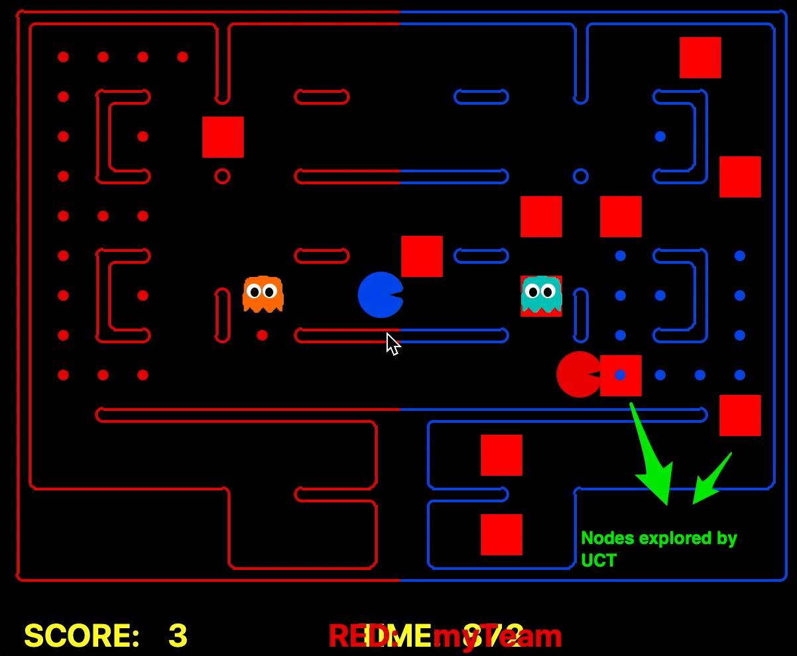
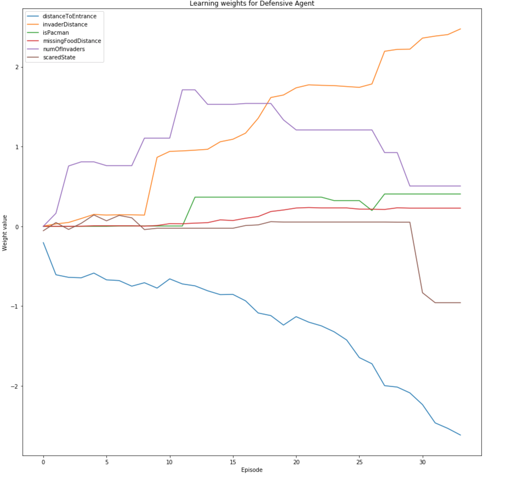
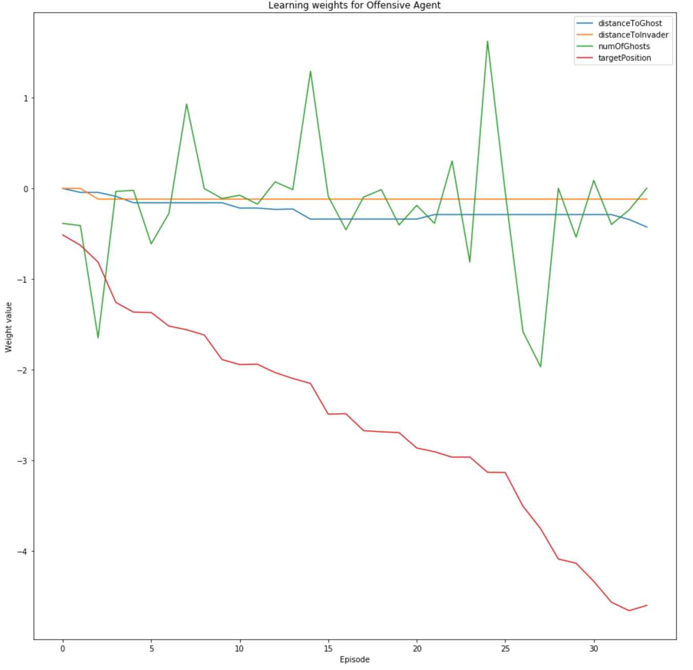
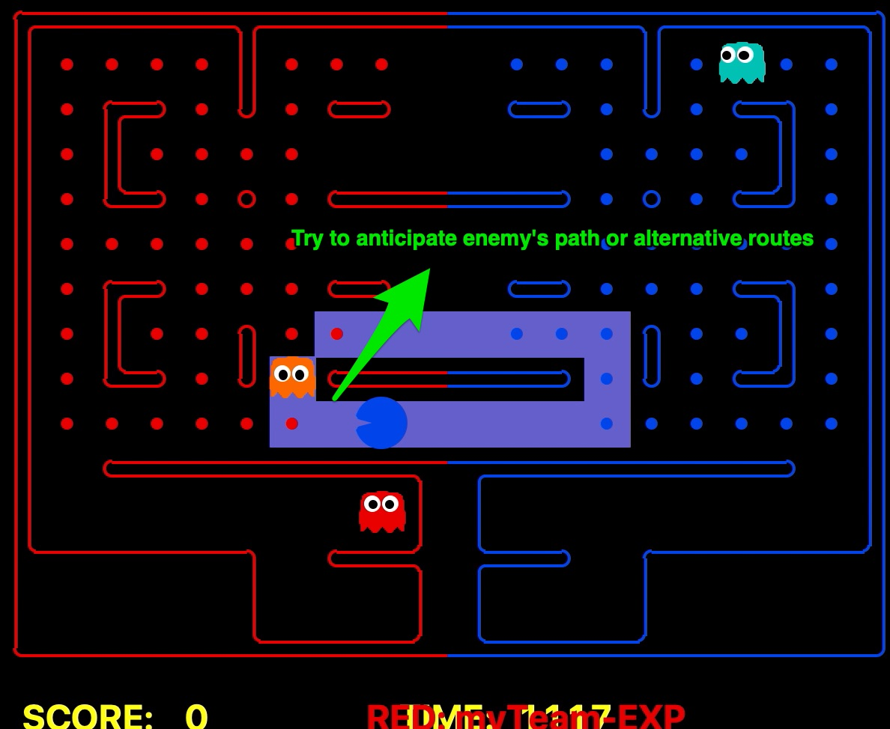

Youtube presentation: https://youtu.be/bXktgko2b7I

             ''' Contest: Pacman Capture the Flag Project Documentation - Team Poison '''

# Introduction
During the first assignment in classical planning, we faced deterministic events, perfect knowledge and a single actor (one Pacman). For Capture the Flag Project, our environment was not fully known, events and act ions from the opponent happen online during the game. As we cannot solve the problem offline, we chose methods that allowed us to select the best possible action online at each step during execution. We made use of classical planning for specific situations where we reduced the uncertainty, make part of the environment as known or when we were able to infer our opponent behaviour.

# Assumptions
* Our agents can only make five moves (East, West, North, South, Stop)
* For offensive agent goes for the farthest food first or when got killed. Because the opponent might guard the nearest food to the border.
* Opponents will eat the nearest food to the food that has been eaten
* Opponents will go for the nearest food to our border first
* When opponents eat food they will take the shortest path to the border

# Methods

## Monte Carlo Tree Search and UCT
We defined a finite number of simulations to draw an MCT and Q(s, a) value if the food was reached or an opponent killed. 
* We set a fixed computational budget for simulations and observed the Q value.
* There were no goals, actions are selected at every state during execution based on Q value 
* For every action possible in the state, we run simulations expanding the nodes and we stopped the simulation according to the budget limit, The Q value was calculated according to predefined features, then backpropagate and update Q-Value.
* We calculated the reward according to strategies, defensive patrol the food according to clusters and offensive go for closest food and comeback following a carry limit.
* Given that we calculated all values for possible actions Q(s, a), our algorithm chose the action with maximum Q and untie randomly.
* We faced the problem with MCT that we were not getting the best actions all the time, in part because of the simulations. With UCT we tried to balance exploration and exploitation. Trying with several constants C_p to balance, however, we faced problems like when defending, we lost track of the opponent and failed to patrol some areas due to simulations didn’t include it.
* Parameters:
  - A range of 10 to 15 iterations
  - Budget limit for simulations: 15
  - Maximum food carrying
* Features used for reward:
  - Offensive:
           *  successorScore: Makes the agent go to look for the food and eat, In addition, when combined with the score made the agent come back to deposit the food.
           *  distanceToFood: Getting minimum distance to pursue the food.
           *  distanceToGhost: Used to avoid ghosts and try not to get killed
           *  isPacman: Used to identify when Pacman in case we want something when is a ghost.
  - Defensive:
           *  numInvaders: Number of invaders in our field
           *  invaderDistance: Minimum maze distance when less than 5 units.
           *  distanceToFoodToSecure: Minimum maze distance to our food. Our food was defined by clusters and the ghost tried to patrol the centre of these clusters.
* Strategies:
  - Carry limit when the offensive was eating food, that will make him go back and deposit
  - Key positions: Set of positions to defend using clusters of food. Agent patrols groups of food trying to keep the opponent away from them.
* Problems: 
  - Exploration and simulation with MCT were not good enough and sometimes the agent took wrong choices.
  - The computational budget was short as we have the time limit to perform the simulation. 
  - The patrol takes a lot of time and we missed the food in other clusters because we were guarding others. 
* Strengths: 
  - Good at the problem concerning with exploration and exploitation rate.
  - Does not need an explicit evaluation function.
* Weaknesses:
  - With the limitation of time, the random exploration is constrained
  - Sensitive to the missing states in simulations

For example, for a particular iteration, here we can see the result of the simulation, sometimes we missed good moves because it was not included in the results. 

## Approximate Q Learning with reward shaping
Balance exploration and exploitation is difficult, the “Fear of Missing Out” motivated us to work on a different approach. We kept the same assumptions from the previous analysis, that is: 
* Our agents do not know the environment. Given different mazes and adversaries, the agent will experience the environment by interacting with it. 
* Using a Q table requires to visit every reachable state many times to get a good estimate of Q(s, a). Here, we have used gameState as state
* The agent has specific game information e.g. Food Carrying accessible from game state.
* The environment will change as the agent take actions and receive rewards.
* Rewards are sparse and there are few state/actions that lead to non-zero rewards. Initially, we started with the only game score but the learning was very slow.
* Our motivation moved to target specific.
Given that we can have a big number of game states, approximation methods helped us to scale our Pacman better, using features to derive a Q(s,a) even for states we haven’t seen before. In addition, we needed a way to communicate our agents that the actions taken were a good choice, we use a reward shaping to deliver this value into the Q.
* Parameters:
  - Learning rate, alpha=0.2
  - Discounted reward, gamma = 0.8
* Offensive:
  - Features:
           *  Minimum distance to avoid ghost.
           *  Number of ghosts in the field that can potentially kill the agent
           *  Minimum distance to the target goal set by strategy
           *  Bias: Noise captured in learning
           *  If the agent has an invader close when in its own field then try to kill it. 
  - Strategies:
           *  Carry Limit: Agent is greedy unless he feels threatened by a ghost. The limit is fixed in the initial state in 10 and changed if no ghosts around or capsule eaten.

           *  Target positions: 
               - Food: The offensive agent set up where he is going considering the closest food and the carry limit. 
               - Going back home: the Offensive agent will choose to go home (border) if the carry limit is reached or if the time is reaching the end of the game to score the carrying food.
               - Eating Capsule: If the opponent agent is near or minimum distance to target food is far from the capsule then eat capsule.
           *  If the agent is stuck then find alternative food to eat using A* method:
           *  Dead-end alleys / safe actions: If a food is risky meaning dead end then leave the food.
           *  Detect if the opponent is scared.
           *  Intercept opponent (see A star method)
           *  Loop Breaker: When avoiding being eaten and go for food our agents enter in a loop which we need to break in order to change the results of the game.
           * Suicide if get trapped/clogged
  - Reward function:
           *  (-) We give a penalty if the agent has not reached the target position at each step, that is helping to decide the best action to get to the target.
           *  (+) If he eats food
           *  (+) if he eats capsules (not present in all the environments)
           *  (score) We give reward/penalize with the current score, positive if winning, negative if losing.
           *  (-) Penalty if get killed
* Defensive:
  - Features:
           *  When agent detect there is missing food it will get the distance to go to the next food closest to the missing food,  this is where the opponent will probably go.
           *  Key positions to defend the field.
               - Center of the cluster of food
               - Minimum distance to the sum of all food from the border
           *  Detect if a capsule was eaten by the enemy and consider the distance to invaders and scared time
           *  Defensive can become to Pacman when in offensive mode, we used the distance to ghost to avoid them when attacking.
           *  How many invaders are in the field.
           *  Bias: Noise captured in learning
           *  The agent will use the invader distance to take an action that gets him closer to the opponent.
  - Strategies:
           *  Agent scared: If a capsule is eaten by the opponent then the agent will escape the home and go in offensive mode until capsule time is over. If we are scared because our opponent ate a capsule the agent will not defend and instead go on the offensive. The offensive is coordinated with the other agent in the sense of not going for food that was previously eaten by the other agent.
           *  It is fixed to 10 food dots unless the agent detects invaders and is set to   unlimited if a capsule is eaten (all you can eat)
           * Target positions: 
               - Missing food define the main target position
               - The entrances are defined as target position when no missing food.
               - Closest food if in offensive mode
               - Go home if carry limit reached or time is over
           *  Shared offensive strategy with the defensive agent: Since our general strategy is more offensive, the agents consider the food that is being eaten by the other agent to set up the next target. If the game score is negative or food to defend is very large than food to eat then the defensive agent also goes to attack.
           *  Clog opponent (see A star method): When chasing our opponent, if we identified our position as the only way out of our opponent, then we stop and wait for the opponent to suicide.
  - Reward function
           * (+) Reward according to food recovered (kill a Pacman)
           * (+/-) Reward for numbers of invaders, positive if the agent gets invaders out of its own field or negative for numbers of invaders still present in our field.
           * (-) Penalty for not getting to the target position
           * (-) Penalty for getting killed.
           * (+) Being offensive and eating food or capsule
           * (+) Being offensive and changing the game score

* Strengths:
  - Fast learning
  - No need of Q-table
  - No need hard coding of weights
  - Reward shaping helped to eradicate the problem of the sparsity of rewards
  - Works well event with zero initial Q value
* Weaknesses:
  - Adding new or updating old feature changes the weights and need to learn again
  - Sometimes falls into a loop if an opponent is chasing

For example, it is shown in the next picture (defensive agent) the training results initializing all weights with 0 for 34 episodes, *target position* tend to have a high negative value which made our agents take actions where the distance is minimum. In the same way, the *distance to invader* and *distance to ghost* (avoid ghosts) have the same behaviour.  

In the offensive agent training, it is shown int the next picture how the *distance to entrance* has a higher weight with negative values causing our agent to take the action with the minimum distance to this position. The same behaviour is seen for *distance to invaders* getting negative values in features.  *Missing food distance* was updated when our enemy eats and it was affected by strategies.

## A-star algorithm
Classical Planning is implemented to solve specific tasks, served as an assistant to the Q-learning agent. The idea is to use it to do tasks like planning an escape path, predicting our opponent’s escape path. Instead of taking a single goal position, in this algorithm, we took a list of goal positions and designed heuristic function to work along with that. In this function, we have a starting position, a list of avoiding positions as well as a list of goal positions. It is designed this way because we are interested in going to multiple goal positions and avoiding multiple positions in the game. For example, finding the optimal path to the nearest food avoiding positions that are very close to our opponent’s ghosts.
* Input: Start Position, Avoid Positions, Goal Positions, GameAgent, GameState
* Output: Goal Position, Path, Cost(Penalty term added)
* Offensive functions related to A-star
  - Planning escape Path
  - Find alternative food to eat 
  - Check dead-ended alley
* Defensive functions related to A-star
  - Clogging the opponent
* Strategies: 
  - Planning escape Path: We only call this function when we needed an escape plan. Here, we set my agent’s position as the StartPosition, positions within 3 steps away from opponent’s ghosts as Avoid Positions, boundaries as the Goal Positions. And A-star is going to return us an optimal path avoiding the ghosts.
  - Find alternative food to eat: Sometimes we come across the situation where our offensive agent goes back and forth with opponent’s defensive agent and we want to break this loop. Therefore, instead of going for the current target food, we try to find the alternative one for it by taking agent’s current position as StartPosition, positions within 3 steps away from opponent’s ghosts as Avoid Positions, the food list as Goal Positions. And A-star will find the alternative food and path for us. 
  - Check dead-ended alley: This function helps our agent to make decisions when it is running away from the opponent’s ghost. The idea is to not let our agents step into a dead-end zone when fleeing. This is realized by taking my successor’s position as the Start Position, my current position as Avoid Positions, the boundaries as the Goal Positions and call A-star function. If A-star returns me a cost that is higher that is larger than the penalty term we set, then we know there is no way out without crossing the Avoid Positions, which means our agent should not go to that position. 
  - Clogging the opponent: This function helps our defensive agent determined to take stop action or not, the idea is to clog our opponent’s only way out and stuck it there, instead of eating the Pacman. To do this, we take the opponent’s position as StartPosition, our agent’s position as the Avoid Positions, and the boundaries as the Goal Positions. If the returned cost is larger than the penalty term, we know we should clog there.
* Strengths: 
  - Good at path planning
  - Always gives the optimal solution
  - Effective
* Weaknesses:
  - Can only be used if the goal is set
  - Only works with proper heuristic function

For example, it is shown in the image how we tried to predict the escape path the opponent will choose based on the A star search result:

# Summary
| Layout              | Agent               | Winning Rate | Score                      | Time                 | Best Competition Rank  | Winning Rate competition |
|---------------------|---------------------|--------------|----------------------------|----------------------|--------|--------------------------|
| Default Capture     | MCT                 | 5/5 (1.00)   | Scores: 11, 11, 17, 12, 1  | Time Up all          | 33/37  | 33%                      |
| Default Capture     | UCT                 | 5/5 (1.00)   | Scores: 10, 11, 3, 6, 8    | Time up all          | 39/61  | 42%                      |
| Default Capture     | Q Learning with A * | 5/5 (1.00)   | Scores: 18, 18, 18, 18, 18 | Returned before time | 17/147 | 76%                      |
| Medium Maze Capture | MCT                 | 5/5 (1.00)   | Scores: 41, 41, 40, 37, 41 | Time Up all          | 33/37  | 33%                      |
| Medium Maze Capture | UCT                 | 5/5 (1.00)   | Scores: 42, 41, 42, 37, 41 | Time up all          | 39/61  | 42%                      |
| Medium Maze Capture | Q Learning with A * | 5/5 (1.00)   | Scores: 41, 41, 42, 42, 7  | Returned before time | 17/147 | 76%                      |

# Workflow
* [Started with Baseline Team with additional features](https://gitlab.eng.unimelb.edu.au/gild/comp90054-pacman/commit/7fb5b58d8ee34b3bee4f52b2a2bd84c38c9440d5)
* [Tried to change the weights manually to perform better](https://gitlab.eng.unimelb.edu.au/gild/comp90054-pacman/commit/1e6c8deda08d8a1819ac0c1ab18d30411f83ceca)
* [MCT to explore the Q value ahead](https://gitlab.eng.unimelb.edu.au/gild/comp90054-pacman/commit/2ad7ddad7092b615beb082851d7336f3195c6084)
* [UCT to balance in between exploration and exploitation Q Learning algorithm and creating Q table](https://gitlab.eng.unimelb.edu.au/gild/comp90054-pacman/commit/37d8e48a780fa662c78117d54a15c29fb953e93f)
* [Q Learning algorithm with Q function approximation](https://gitlab.eng.unimelb.edu.au/gild/comp90054-pacman/commit/61dcc1d06c97dd73e9b080414c5785425cd8f531)
* [Q Learning algorithm with Q function approximation and reward shaping](https://gitlab.eng.unimelb.edu.au/gild/comp90054-pacman/commit/fb65e047355f7508078ae53a6a0cf9a3f57b14a7)
* [Key positions](https://gitlab.eng.unimelb.edu.au/gild/comp90054-pacman/commit/61dcc1d06c97dd73e9b080414c5785425cd8f531)
* [To find alternative path (Heuristic Search algorithm (A* method))](https://gitlab.eng.unimelb.edu.au/gild/comp90054-pacman/commit/01571bf0bd6d25895e21e2c45744ca523a652709)
* [To clog the opponent (Heuristic Search algorithm (A* method))](https://gitlab.eng.unimelb.edu.au/gild/comp90054-pacman/commit/f04bb075fb2ead3c14153fb380dbb837bcac4ad0)
* [Planning escape path (Heuristic Search algorithm (A* method))](https://gitlab.eng.unimelb.edu.au/gild/comp90054-pacman/commit/3f9c3881592f31005e4d505381c7effdae11f61a)
* [Check dead-ended alley (Heuristic Search algorithm (A* method))](https://gitlab.eng.unimelb.edu.au/gild/comp90054-pacman/commit/b10a7716af71f5a0dd15fc17bbae708c44397f48)
* [Avoid alley food when ghost is near](https://gitlab.eng.unimelb.edu.au/gild/comp90054-pacman/commit/b10a7716af71f5a0dd15fc17bbae708c44397f48)
* [Intercept opponent](https://gitlab.eng.unimelb.edu.au/gild/comp90054-pacman/commit/e6351e8b031aaee7598f5b0cf5fcd41b36c86a95)
* [Final Submission](https://gitlab.eng.unimelb.edu.au/gild/comp90054-pacman/commit/cfa8827e8a16658377ccfab9097a366cb3a4f48d)

# Youtube presentation

Poison Video: https://youtu.be/bXktgko2b7I

<figure class="video_container">
  <iframe src="https://youtu.be/bXktgko2b7I" frameborder="0" allowfullscreen="true"> </iframe>
</figure>

## Team Members

List here the full name, email, and student number for each member of the team:

* Kazi Abir Adnan - kadnan@student.unimelb.edu.au - 940406
* Yingkun Huang - yingkunh@student.unimelb.edu.au - 936764
* Daniel Gil - gild@student.unimelb.edu.au - 905923
